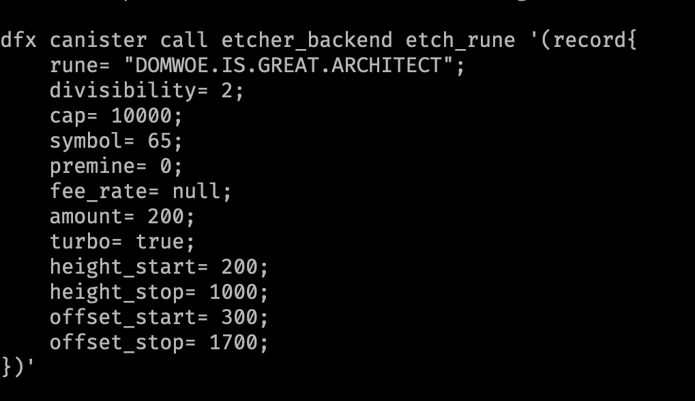

# Etcher

# TODO
- Payment using CkBTC

### Deployment Guide

#### Pre-requisites
- [candid-extractor](https://github.com/dfinity/cdk-rs/tree/main/src/candid-extractor)
- [dfx](https://github.com/dfinity/sdk)
- [docker](https://www.docker.com)

Running the docker
```bash
# for linux users
./init.sh

# for mac users
DOCKER_DEFAULT_PLATFORM=linux/amd64 ./init.sh
```

```bash
# Optional Step
chmod +x gen_candid.sh
./gen_candid_and_wasm.sh # Generates the candid file

dfx start --clean # run the localhost in a different screen

chmod +x deploy.sh
./deploy.sh # Deploys all the canisters
```

### Ordinal Server
You can access the Ordinal server at http://localhost:8080

### Known Issues
- After the timer hits for Rune's reveal transaction while requesting the `Utxos`, The Canister might panic due to Bitcoin's canister not being fully synced. This will cause the reveal transaction to be submitted on the next timer interval

### Architecture


### [Video Tutorial on How to Etch a Rune](https://www.youtube.com/watch?v=EbCmAyiYuJo)

### Etching Rune through Terminal

```bash
dfx canister call etcher_backend get_deposit_address_for_bitcoin # returns a bitcoin address

docker compose exec bitcoind bitcoin-cli generatetoaddress 1 <Bitcoin-Address>

docker compose exec bitcoind bitcoin-cli -generate 101 # generating 101 blocks due to coinbase 100 blocks maturity rule

dfx canister call etcher_backend etch_rune '(record{
    rune= "DOMWOE.IS.GREAT.ARCHITECT";
    divisibility= 2;
    cap= 10000;
    symbol= 65;
    premine= 0;
    amount= 200;
    turbo= true;
    height_start= 200;
    height_stop= 1000;
    offset_start= 300;
    offset_stop= 1700;
    fee_rate= null;
})'

docker compose exec bitcoind bitcoin-cli -generate 1 # run this command on another window

docker compose exec bitcoind bitcoin-cli -generate 6 # mine 6 blocks for reveal transaction

docker compose exec bitcoind bitcoin-cli -generate 6 # run this command after the reveal transaction is submitted
```
You've successfully etched a rune, check on http:localhost:8080/runes

### Explaining the Arguments



- `rune`<br>
    Names consist of the letters A through Z and are between one and twenty-six letters long. For example UNCOMMONGOODS is a rune name. Names may contain spacers, represented as bullets, to aid readability. UNCOMMONGOODS might be etched as UNCOMMON•GOODS. The uniqueness of a name does not depend on spacers. Thus, a rune may not be etched with the same sequence of letters as an existing rune, even if it has different spacers. Spacers can only be placed between two letters. Finally, spacers do not count towards the letter count.
- `divisibility`<br>
    A rune's divisibility is how finely it may be divided into its atomic units. Divisibility is expressed as the number of digits permissible after the decimal point in an amount of runes. A rune with divisibility 0 may not be divided. A unit of a rune with divisibility 1 may be divided into ten sub-units, a rune with divisibility 2 may be divided into a hundred, and so on.
- `symbol`<br>
    A rune's currency symbol is a single Unicode code point, for example $, ⧉, or 🧿, displayed after quantities of that rune. 101 atomic units of a rune with divisibility 2 and symbol 🧿 would be rendered as 1.01 🧿. If a rune does not have a symbol, the generic currency sign ¤, also called a scarab, should be used. Here symbol as provided as number value. For e.g. `A` is 65, `😎` is 55357.
- `cap`<br>
    The number of times a rune may be minted is its cap. A mint is closed once the cap is reached.
- `premine`<br>
    The etcher of a rune may optionally allocate to themselves units of the rune being etched. This allocation is called a premine. If `premine` is equals to `cap`, it makes the runestone unmintable.
- `amount`<br>
    The amount of the token to be minted per every Mint transaction.
- `turbo`<br>
    Flag to opt in for future protocol changes. Should be a boolean value.
- `height_start`<br>
    A mint is open starting in the block with the given start height.    
- `height_stop`<br>
    A rune may not be minted in or after the block with the given end height.
- `offset_start`<br>
    A mint is open starting in the block whose height is equal to the start offset plus the height of the block in which the rune was etched. For e.g. If the etching transaction's block was 100, after n number of blocks anyone can performing minting of the runestone.
- `offset_stop`<br>
    A rune may not be minted in or after the block whose height is equal to the end offset plus the height of the block in which the rune was etched. For e.g. If the etching transaction's block was 100, after n number of blocks, mint will be closed.

### Address for mainnet

- frontend: https://kho2y-sqaaa-aaaag-qjuta-cai.icp0.io/
- backend: https://a4gq6-oaaaa-aaaab-qaa4q-cai.raw.icp0.io/?id=dyb47-nqaaa-aaaag-qjvba-cai
